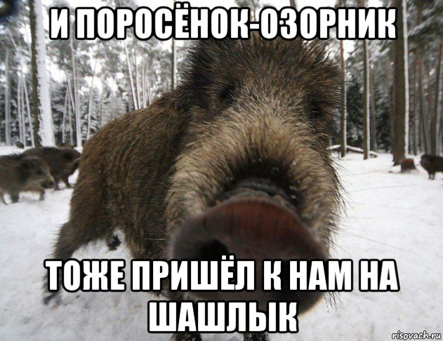

#___Hello. It's my github account___
 ## Зачем я это сделал?
 1. Меня заставил Дима
 2. Мне стало интересно, что такое гитхаб
 3. У меня есть свободное время

 


## Пример кода мигания светодиодом 

 ```C++
void setup() {
  pinMode(2,OUTPUT)

}

void loop() {
 digitalWrite(2,HIGH);
 delay(1000);
 digitalWrite(2,LOW);
 delay(1000);
}

> Мои друзья дебилы, давно пора понять
> Мои друзья дебилы и их не поменять
> Мои друзья дебилы, дебилы навсегда
> Но так как я и сам такой, то это не беда.


